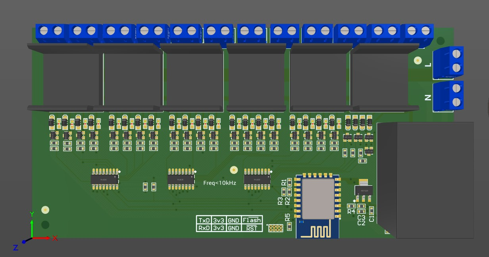

# Mechanics/Circuit Design
Circuit design files of HOMEANDA-24ChannelLightController.  

## Environment 
To open and edit this PCB Design Project, an installation of Altium Designer 15 or higher version is required.

To check your software compatibility, go to `Help` >> `about` >> `build version`

## Review

##Progame 
