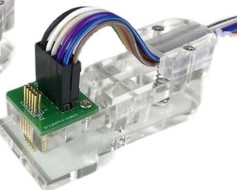

# Mechanics/Circuit Design
Circuit design files of HOMEANDA-24ChannelLightController.  

## Environment 
To open and edit this PCB Design Project, an installation of Altium Designer 15 or higher version is required.

To check your software compatibility, go to `Help` >> `about` to check your AD build version.

## Review

## Program & Burn

These pads will be used to program and debug the ESP-12 Module. Use a 1.27mm 2x4P clamp to connect:

https://item.taobao.com/item.htm?spm=a1z10.1-c.w4004-8254529434.3.219189fcMV5dlw&id=657520999591

1. Connect Flash Pad to GND
2. Connect serial wire to TxD and RxD Pads.(If your USB-to-Serial module don't have protective/impendance resistors, apply them to serial wires).
3. Add 3.3V external power supply.
4. The device will enter flash mode then.
