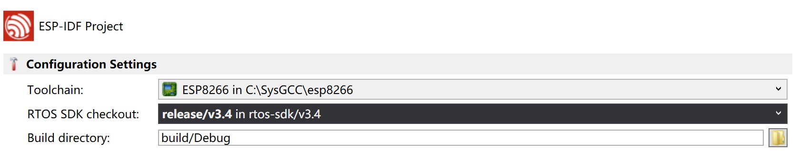

# HOMEANDA-24ChannelLightController
HOMEANDA-24ChannelLightController is designed to integrate into your household distribution cabinet, with each capable to control up to 24 lights.

## About 
- This is a normal ESP-IDF Makefile project managed by VisualGDB Plug-in. Use VisualGDB equipped Visual Studio to Edit&Run the code.
- ESP8266 SDK version: `GCC8.4.0`, `GDB8.1` with `RTOS-sdk3.4`.
- You can download&install this SDK at VisualGDB official website. Package name is "esp8266-gcc8.4.0".Redirection link: https://sysprogs.com/getfile/1499/esp8266-gcc8.4.0.exe
- Do remember to re-config your toolchain before build.

